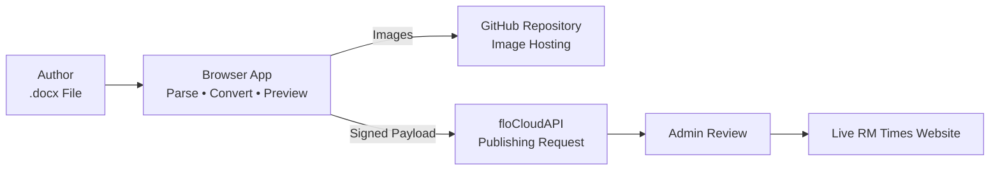

# rmtimesuploader
Submit your article in docx format using this single page html for publishing in RanchiMall Times


```markdown

---

## 🏗️ Architecture & Cloud Integration

The RM Times Content Publisher is a fully client-side application. It processes `.docx` files in the browser, uploads embedded images to GitHub, cryptographically signs article metadata, and submits publishing requests to the RanchiMall decentralized cloud.



### Publishing Workflow

| Stage | Component | Purpose |
|-------|-----------|---------|
| **1** | **Browser Client** | Reads the `.docx` file locally using **JSZip** and **DOMParser**. No server-side processing occurs. |
| **2** | **Content Extraction** | Extracts headings, paragraphs, tables, formatting, and embedded images while preserving document structure. |
| **3** | **GitHub Image Hosting** | Uploads extracted images to the `ranchimall/rmtimes` repository and replaces local references with hosted image URLs. |
| **4** | **Cryptographic Authentication** | Uses `floCrypto.js` to derive the author's FLO identity from their WIF key and digitally authenticate the submission. |
| **5** | **Decentralized Submission** | Sends the authenticated publishing request to RanchiMall SuperNodes via `floCloudAPI.sendGeneralData()`. |
| **6** | **Editorial Approval** | RM Times administrators review the submitted article before publication. |
| **7** | **Publication** | Once approved, the article becomes available on the live RM Times website. |

### Integrated Technologies

| Technology | Role |
|------------|------|
| **JSZip** | Reads and extracts `.docx` archives entirely in the browser. |
| **DOMParser** | Parses Word XML into HTML content. |
| **GitHub REST API** | Hosts embedded images. |
| **floCrypto.js** | Generates FLO identity and signs submissions. |
| **floCloudAPI** | Stores authenticated publishing requests on RanchiMall SuperNodes. |

---
```


---


## 📡 Cloud & Protocol Details


### 1. FLO Blockchain & SuperNode Infrastructure

- **SDK Dependencies**: `floCrypto.js`, `floCloudAPI.js`, `lib.js`

- **Application Context**: `RM_Times`

- **SuperNodes Connected**:

  - `ranchimallcloud1.duckdns.org` (PubKey: `03A0AD65FFBB8CAE0316BC93EE2BD6BDDF3A47970C2D550E4E1C7DFC559F131EA2`)

  - `ranchimallcloud0.duckdns.org` (PubKey: `03DABC832B95F088CA88F87D154B73B415F085945CFF3D4C36DCE081518D229B31`)

- **Target Receiver ID**: `FF5pewfsJxyrCvg8a2C8VXefeyVvKvQxmF` (RM Times Admin Vector)

- **Data Channel**: `publishing_requests`


### 2. GitHub REST API Image Pipeline

- **Target Repository**: `ranchimall/rmtimes`

- **Target Branch**: `imageinsidearticle`

- **Upload Endpoint**: `https://api.github.com/repos/ranchimall/rmtimes/contents/images/{filename}`

- **Authentication**: GitHub Personal Access Token (PAT) with `contents: write` permission.


---


## 🚀 How It Works & Publishing Flow


### Step 1: Document Upload & Conversion

1. Select a `.docx` document in the browser interface.

2. The internal parser reads OOXML files (`word/document.xml`, `styles.xml`, `rels`, `core.xml`).

3. Heading tiers are determined using a priority fallback system:

   - **Style Tier**: Word Heading styles (`Heading 1`, `Title`, etc.).

   - **Numbered Tier**: Numbered patterns (e.g., `1. Introduction`).

   - **Heuristic Tier**: Short line length without terminal sentence punctuation.


### Step 2: Inspection & Verification (Optional)

- **Download JSON**: Save the processed article payload (`title`, `content`, `readTime`).

- **Download Preview HTML**: Generate a standalone HTML file to review image rendering and table formatting before sending.


### Step 3: WIF Authentication & Image Upload

1. Enter your Subadmin/Author Private Key in **WIF format**.

2. The application derives your FLO Address locally.

3. If images are present, enter a GitHub Personal Access Token to upload extracted images to `ranchimall/rmtimes/images/`.


### Step 4: SuperNode Submission & Approval

1. Enter any additional **Contributor FLO IDs** (comma-separated).

2. The application dispatches the payload to the `publishing_requests` vector on the SuperNode cloud network.

3. **Approval Requirement**: The request enters the pending queue. The article will only appear live on RM Times once an authorized **RM Times Subadmin/Admin** approves the request.


---


## 💻 Installation & Usage


Because the app is self-contained in a single HTML file with CDN dependencies, no server or build setup is required.


### Running Locally

1. Clone the repository:

   ```bash

   git clone https://github.com/ranchimall/rmtimes.git

   ```

2. Open the publisher HTML file in any modern web browser.


---


## ⚙️ Configuration Reference


| Parameter | Value / Variable | Description |

| :--- | :--- | :--- |

| **`floGlobals.application`** | `"RM_Times"` | Application name scope for SuperNode queries |

| **`floGlobals.adminID`** | `"FNaN9McoBAEFUjkRmNQRYLmBF8SpS7Tgfk"` | Primary admin FLO ID |

| **`receiverID`** | `"FF5pewfsJxyrCvg8a2C8VXefeyVvKvQxmF"` | Publishing request target queue address |

| **`GITHUB_REPO`** | `"rmtimes"` | Image destination repository |

| **`GITHUB_BRANCH`** | `"imageinsidearticle"` | Branch for uploaded image assets |


---


## 🔐 Security Considerations


- **Private Key Safety**: WIF Private Keys are processed purely in client-side memory using `floCrypto.js`. Private keys are **never stored** locally or transmitted over network calls.

- **HTML Sanitization**: All content is sanitized via `DOMPurify` before dispatching to neutralize unauthorized `<script>` tags or malicious inline attributes.

- **GitHub Token Handling**: GitHub PATs are held in volatile memory only during the active browser session to execute the image upload API calls.

```
